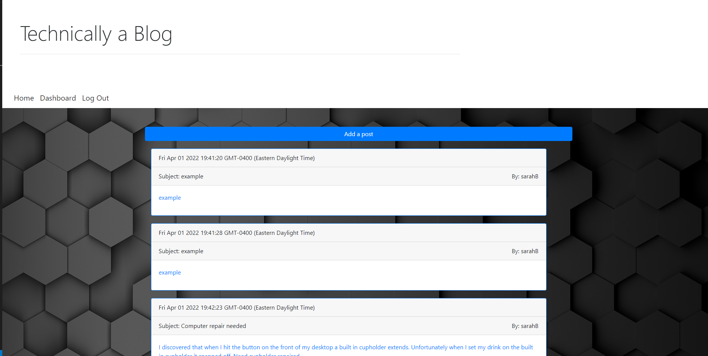
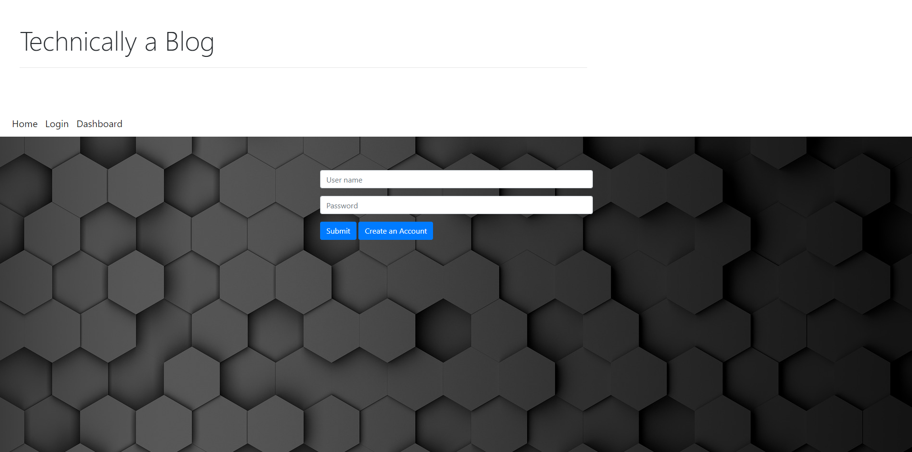

# Technically-a-Blog

## Description
Some features of this application.
1. Main page has blogs that can only be commented on by signed in users.
2. Buttons on all blogs appear only when blog is cliked on.
3. Dashboard can only be accessed by signed in users. User's comment can be viewed on the dashboard. They can also be updated and deleted on this page. 
4. User will be signed out after one hour.

---

## Table of content

* [Description](#description)

* [Usage](#usage)

* [How to Contribute](#how-to-contribute)

* [Links](#links)

* [Questions](#questions)

* [Technologies](#technologies)

* [Pictures](#pictures)

---

## Usage

Blog about tech. 

## How to Contribute

Pull requests. Feel free to open a pull requst on my GitHub.

## Questions

If you have nay questions about this project then you can contact me directly at 

elizabethdberube@gmail.com

----

## Technologies

Technologies used in this project:

* Express
* Path
* Sequelize
* Handlebars
* Session

----

## Links

[GitHub Repo](https://github.com/elizabethdberube/Technically-a-Blog) 

[Deployed Application](https://technically-a-blog-2.herokuapp.com/) 

----

## Pictures

